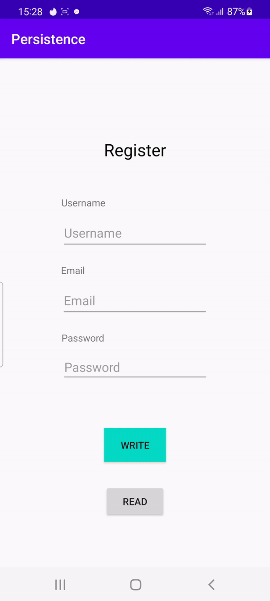

# Rapport

I denna labb ska vi spara data i en databas (SQLlite), hence namnet "Persistence" då datan finns kvar
efter stängning av app!

## Formen

Jag skapade ett simpelt formulär där man kan skriva in användarnamn, email och lösenord. NOTERA att
ingen validering görs, eller hashning av lösenord! I denna uppgift är det dock databasen som är intressant,
så jag skippar denna kodsnutt.

## Tabeller

Först och främst behöver vi tabeller, detta gör jag genom 'DatabaseTables.java' som då hanterar tabellerna
och modellen "User". 

```
// DatabaseTables.java

package com.example.persistence;

public class DatabaseTables {

    static final String SQL_CREATE_TABLE_USER =
            "CREATE TABLE " + User.TABLE_NAME + " (" +
                    User.COLUMN_NAME_USERNAME + " STRING, " +
                    User.COLUMN_NAME_EMAIL + " STRING," +
                    User.COLUMN_NAME_PASSWORD + " STRING)";

    static final String SQL_DELETE_TABLE_USER =
            "DROP TABLE IF EXISTS " + User.TABLE_NAME;

    static class User {
        static final String
            TABLE_NAME = "user",
            COLUMN_NAME_USERNAME = "username",
            COLUMN_NAME_EMAIL = "email",
            COLUMN_NAME_PASSWORD = "password";
    }
}
```

Klassen DatabasTables får en statisk-klass (behöver inte instanseras) User. Den har tre-stycken 
konstanta (final, i princip const) variabler med vars syfte: username, email och password. De två övre
konstant-strängerna är SQL-queries som skickas till databasen (SQL) för att skapa en tabell samt ta bort.

## Database Helper

Detta är då själva databasen, där namn (för databasen) och tabeller skapas för denna databas. I mitt fall
skapar jag filen "User.db". Om det redan finns en databas kommer den endast sätta in värden och ignorera 
att skapa en ny databas-fil. I denna uppgift kommer vi i princip endast använda oss av onCreate(), då 
vi kommer inte ändra något i databasen senare, såsom uppdateringar.

```
// DatabaseHelper.java

package com.example.persistence;

import android.content.Context;
import android.database.sqlite.SQLiteDatabase;
import android.database.sqlite.SQLiteOpenHelper;

public class DatabaseHelper extends SQLiteOpenHelper {

    private static final int DATABASE_VERSION = 1; // If this is incremented onUpgrade() will be executed
    private static final String DATABASE_NAME = "User.db"; // The file name of our database

    DatabaseHelper(Context context) {
        super(context, DATABASE_NAME, null, DATABASE_VERSION);
    }

    // This method is executed only if there is not already a database in the file `User.db`
    @Override
    public void onCreate(SQLiteDatabase sqLiteDatabase) {
        sqLiteDatabase.execSQL(DatabaseTables.SQL_CREATE_TABLE_USER);
    }

    // This method is executed only if the database version has changed, e.g. from 1 to 2
    @Override
    public void onUpgrade(SQLiteDatabase sqLiteDatabase, int oldVersion, int newVersion) {
        sqLiteDatabase.execSQL(DatabaseTables.SQL_DELETE_TABLE_USER);
        onCreate(sqLiteDatabase);
    }

}
```

## Sätta in data

Alla inmatningar som görs i formen skickas till MainActivity, som i princip bara sätter in datan in i 
databasen med hjälp av "addUser()" metoden. All data som skickas måste vara inom sträng-typ, annars blir det knas.
Genom att instansera objekt ur DataBaseHelper dess objekt getWritableDatabase() kan vi leka med databasen.
Med en knapptryckning (writeBtn) skickas sträng-datan in till databasen. Om man istället klickar på (readBtn)
skickas man till nästa aktivitet, där all data visas.

```
// MainActivity.java

(...)

// Create

    databaseHelper = new DatabaseHelper(this);
    database = databaseHelper.getWritableDatabase();

    writeBtn = findViewById(R.id.write);
    readBtn = findViewById(R.id.read);

    username = findViewById(R.id.username);
    email = findViewById(R.id.email);
    password = findViewById(R.id.password);

    // Triggers sending input data to SQL-database
    writeBtn.setOnClickListener(view -> {
        addUser(
                username.getText().toString(),
                email.getText().toString(),
                password.getText().toString()
        );
    });

    // Triggers read from SQL-database
    readBtn.setOnClickListener(view -> {
        Intent intent = new Intent(this, activity_read.class);
        startActivity(intent);
    });

}

private long addUser(String username, String email, String password) {
    ContentValues values = new ContentValues();
    values.put(DatabaseTables.User.COLUMN_NAME_USERNAME, username);
    values.put(DatabaseTables.User.COLUMN_NAME_EMAIL, email);
    values.put(DatabaseTables.User.COLUMN_NAME_PASSWORD, password);
    return database.insert(DatabaseTables.User.TABLE_NAME, null, values);
}
```


## getUsers();

På denna sida visas all data, genom att först hämta all data från tabellen ur databasen. Vi använder oss inte
utav någon häftig indexering eller något annat, utan helt enkelt hämtar all data ur databasen (getUsers()). 
Notera att ingen felhantering görs, så om något går fel så kraschar tyvärr appen. Det metoden i princip gör, är att 
köra igång SELECT query för tabellen User. All data kommer skickas in till en List<User> array. För varje rad,
kommer alla stränger (username, email, password) sättas in som ett objekt (user) och somsagt skickas in till listan. Cursor, kan
man säga är varje rad, som vi är på just nu.

All data presenteras sedan på en TextView, med hjälp av en for-loop.

```
@Override
protected void onCreate(Bundle savedInstanceState) {
    super.onCreate(savedInstanceState);
    setContentView(R.layout.activity_read);

    // Create
    databaseHelper = new DatabaseHelper(this);
    database = databaseHelper.getWritableDatabase();

    List<User> users = getUsers();

    TextView list = findViewById(R.id.dataList);

    list.setText("");

    for(int i = 0; i < users.size(); i++) {
        User user = users.get(i);
        String text = list.getText().toString();
        text += "Username: "+user.getUsername()
                +" Email: "+user.getEmail()
                +" Password: "+user.getPassword()
                +"\n";
        list.setText(text);
    }

}

private List<User> getUsers() {
    Cursor cursor = database.query(DatabaseTables.User.TABLE_NAME, null, null, null, null, null, null);
    List<User> users = new ArrayList<>();
    while (cursor.moveToNext()) {
        User user = new User(
                cursor.getString(cursor.getColumnIndexOrThrow(DatabaseTables.User.COLUMN_NAME_USERNAME)),
                cursor.getString(cursor.getColumnIndexOrThrow(DatabaseTables.User.COLUMN_NAME_EMAIL)),
                cursor.getString(cursor.getColumnIndexOrThrow(DatabaseTables.User.COLUMN_NAME_PASSWORD))
        );
        users.add(user);
    }
    cursor.close();
    return users;
}
```
 
